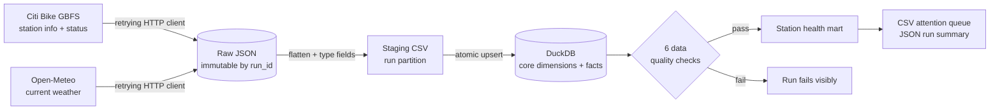
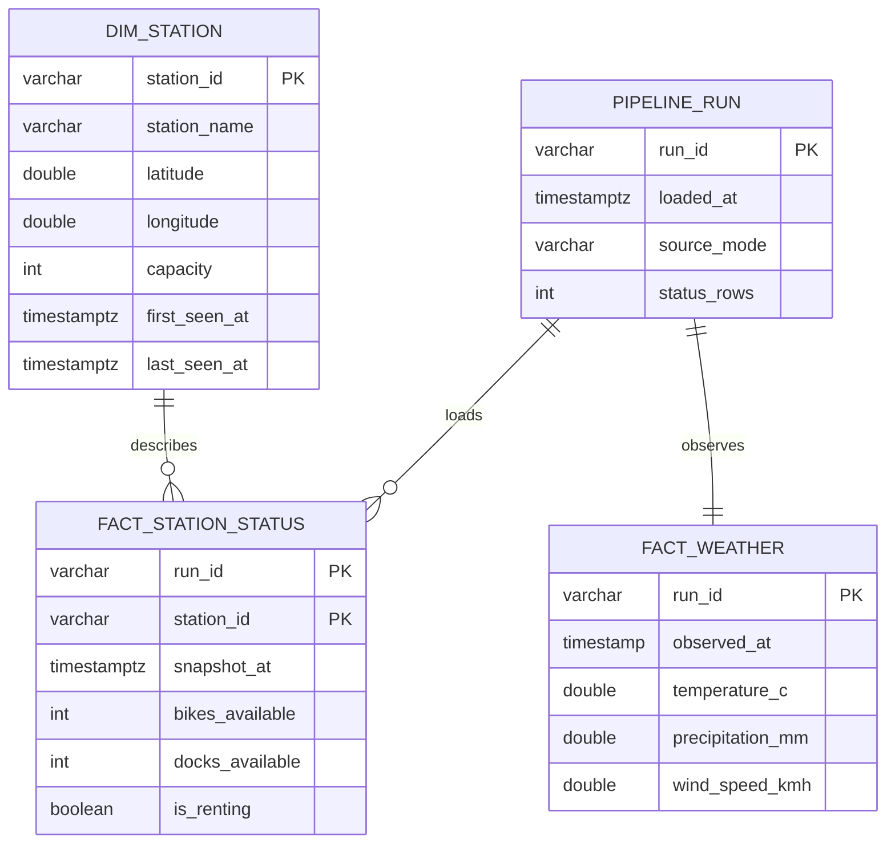

# BikePulse NYC

An incremental data pipeline for answering a practical bike-share operations question: **which Citi Bike stations need attention right now, and which remain constrained over time?**

The project ingests live GBFS station data and Open-Meteo weather, preserves immutable source payloads, normalizes them into staging files, loads an idempotent DuckDB warehouse, validates each run, and publishes an operations-ready station-health mart.

## Key highlights

- Real, changing data from two public APIs; no account or API key required.
- Raw → staging → dimensional warehouse → analytical output with run-level lineage.
- Atomic loads and stable run IDs make retries safe: reprocessing a run replaces its facts.
- Six executable data contracts catch missing, duplicate, orphaned, negative, or geographically invalid records.
- A checked-in 200-station API capture makes the full pipeline reproducible offline.
- Tested CLI, Docker demo, and GitHub Actions workflow.

The committed sample run produced **200 station records**: 83 healthy, 49 low on bikes, 43 low on docks, and 25 offline. These figures describe the captured moment—not general system performance. See the real [summary](outputs/pipeline_summary.json) and [attention queue](outputs/stations_needing_attention.csv).

## Architecture



This is deliberately a local-first architecture. The workload is small enough for an embedded analytical database; adding Spark, Kafka, or Kubernetes would make the demo harder to run without solving a real scaling problem.

## Data model



`marts.station_health` joins those tables and assigns a transparent operational status: offline, low bikes, low docks, or healthy. The classification is intentionally a SQL rule, not an opaque score.

## Run it

Requires Python 3.11+.

```bash
python -m venv .venv
# Windows: .venv\Scripts\activate
source .venv/bin/activate
pip install -e ".[dev]"

# Fully offline, deterministic demonstration
python -m bikepulse run --source sample --run-id local-demo

# Current public API data
python -m bikepulse run --source live

ruff check src tests
pytest
```

Or run the offline demo in a container:

```bash
docker compose up --build
```

The database is created at `data/warehouse/bikepulse.duckdb`; raw and staging run partitions live beneath `data/`. Generated recruiter-facing outputs appear in `outputs/`.

## Incremental and failure behavior

Every acquisition receives a `run_id`. Raw JSON is written to `data/raw/<run_id>/` with source URLs, sizes, and SHA-256 checksums. An existing raw file with conflicting bytes is never overwritten. Staging rows retain the same ID, and the warehouse load runs in one transaction.

Replaying an ID deletes and reinserts only that run's facts, upserts station attributes, and replaces its audit record. A network error is retried with bounded exponential backoff; a transformation, load, or quality failure rolls back or exits non-zero. A scheduler could therefore retry the same ID without creating duplicates.

## Data quality strategy

The pipeline asserts that each run has status rows, unique station keys, no orphan facts, nonnegative inventory, plausible NYC coordinates, and at least 95% station-metadata coverage. Tests also corrupt a loaded row deliberately to prove the relevant check fails.

## Repository map

```text
src/bikepulse/        ingestion, normalization, loading, checks, CLI
sql/schema.sql        dimensions, facts, audit table, mart view
sql/analytical_queries.sql  three human-readable consumption queries
data/sample/          compact real API capture plus provenance
tests/                integration, replay, and contract-failure tests
outputs/              actual sample-run summary and attention queue
docs/                 walkthrough and interview preparation
config/settings.toml  source endpoints and operational thresholds
```

Start with [`src/bikepulse/pipeline.py`](src/bikepulse/pipeline.py), then read the ingestion, transform, and warehouse modules. A guided route is in [`docs/project_walkthrough.md`](docs/project_walkthrough.md).

## Engineering decisions and tradeoffs

- **DuckDB over PostgreSQL:** zero-service setup makes the project easy to review, while still demonstrating SQL modeling, constraints, transactions, and analytical queries. PostgreSQL becomes appropriate with concurrent writers or a serving API.
- **Explicit Python orchestration:** this pipeline has five short sequential tasks. A workflow server would add more operational surface than value; the CLI is ready to schedule with cron, GitHub Actions, Prefect, or Airflow later.
- **CSV staging:** small normalized extracts remain inspectable with any editor. At sustained high frequency, partitioned Parquet would reduce storage and scan cost.
- **Central weather observation:** one downtown reading is sufficient to demonstrate multi-source integration, but it does not represent neighborhood microclimates.

## Limitations and next steps

GBFS is a current-state feed, so history begins when the pipeline is scheduled. Station capacity can also be zero or temporarily inconsistent during maintenance. With several weeks of snapshots, the next useful addition would be time-windowed reliability metrics and a map—not more infrastructure. In a shared production environment, I would move facts to PostgreSQL or object storage, publish check metrics, add alert routing, and run the same CLI from a managed scheduler.

Data sources: [Citi Bike GBFS](https://gbfs.citibikenyc.com/gbfs/gbfs.json) and [Open-Meteo](https://open-meteo.com/). Their upstream terms and availability apply.

